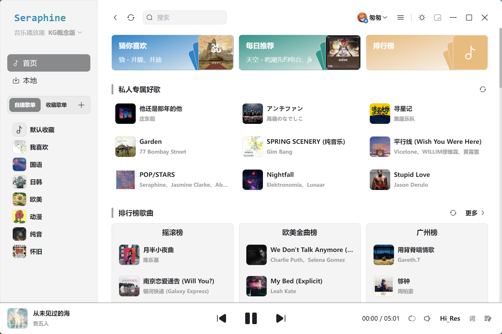
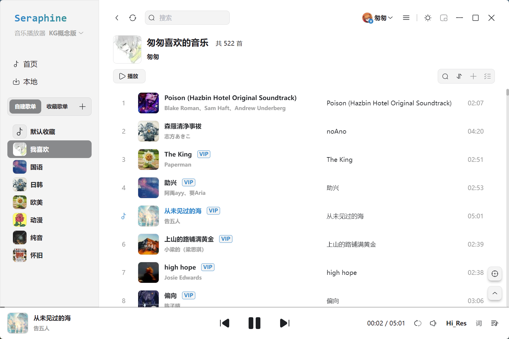
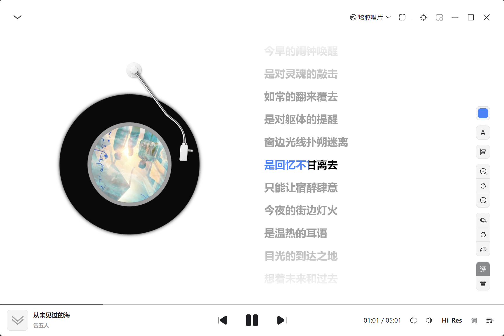

<div style="display: flex;justify-content: center;align-items: center;gap: 16px;">
   
   <strong style="font-size: 32;line-height: 0">Seraphine Music</strong>
</div>

> 一个体积小、启动快的简易音乐播放器

[](https://opensource.org/licenses/MIT)
[](https://tauri.app/zh-cn/)
[](https://cn.vuejs.org/)
[](https://www.typescriptlang.org/)

## ✨ 功能特性

- 📦 **包体积小** - 打包后体积仅3mb ~ 10mb
- ⚡ **启动快速** - 目前只有必要配置, 可以保证应用打开速度
- 🚀 **性能可靠** - 核心逻辑在rust端
- 🌐 **无额外服务** - 酷狗接口从KuGouMusicApi移植到rust, 后端直发请求

## 📸 预览

- 主界面
  
- 播放列表
  
- 歌词页
  

### 开发环境运行

#### 前置要求同 [Tauri](https://tauri.app/zh-cn/)

## 🛠️ 技术栈

- **[Tauri](https://tauri.app/zh-cn/)** - 创建小型、快速、安全、跨平台的应用程序
- **[Vue](https://cn.vuejs.org/)** - 易学易用，性能出色，适用场景丰富的 Web 前端框架。
- **[TypeScript](https://www.typescriptlang.org/)** - 类型安全的 JavaScript 超集
- **[Tailwind CSS](https://tailwindcss.com/)** - 原子化 CSS 框架

## 📁 项目结构

```
SeraphineMusic/
├── src/                  # 前端 Vue 代码
│   ├── assets/           # 静态资源（图片、音频等）
│   ├── components/       # 可复用组件
│   ├── layout/           # 布局组件
│   │   ├── Aside/        # 侧边栏
│   │   ├── Header/       # 头部栏
│   │   ├── LyricPage/    # 播放页
│   │   ├── Main/         # 主体内容
│   │   └── Playbar/      # 播放栏
│   ├── router/           # 路由配置
│   ├── stores/           # 状态管理
│   ├── styles/           # 全局样式
│   ├── types/            # TypeScript 类型定义
│   ├── utils/            # 工具函数
│   ├── views/            # 页面视图
│   ├── desktop-lyric.ts  # 桌面歌词入口文件
│   └── main.ts           # 播放器入口文件
├── src-tauri/            # Tauri 后端
│   ├── icons/            # 应用图标
│   ├── src/              # Rust 源码
│   │   ├── api/          # 酷狗接口
│   │   ├── http/         # http客户端
│   │   ├── music/        # 音频处理
│   │   ├── system/       # 系统配置
│   │   ├── utils/        # 工具函数
│   │   └── main.rs
│   └── tauri.conf.json
├── screenshots/          # 项目截图
└── package.json
```

## 📄 许可证

本项目采用 [MIT 许可证](LICENSE)。

## 🙏 致谢

感谢以下开源项目：

- [KuGouMusicApi](https://github.com/MakcRe/KuGouMusicApi) - 酷狗音乐 Node.js API service

## 免责声明

> 1. 本项目仅供学习使用，请尊重版权，请勿利用此项目从事商业行为及非法用途!
> 2. 使用本项目的过程中可能会产生版权数据。对于这些版权数据，本项目不拥有它们的所有权。为了避免侵权，使用者务必在 24 小时内清除使用本项目的过程中所产
>    生的版权数据。
> 3. 由于使用本项目产生的包括由于本协议或由于使用或无法使用本项目而引起的任何性质的任何直接、间接、特殊、偶然或结果性损害（包括但不限于因商誉损失、停
>    工、计算机故障或故障引起的损害赔偿，或任何及所有其他商业损害或损失）由使用者负责。
> 4. **禁止在违反当地法律法规的情况下使用本项目。** 对于使用者在明知或不知当地法律法规不允许的情况下使用本项目所造成的任何违法违规行为由使用者承担，本
>    项目不承担由此造成的任何直接、间接、特殊、偶然或结果性责任。
> 5. 音乐平台不易，请尊重版权，支持正版。
> 6. 本项目仅用于对技术可行性的探索及研究，不接受任何商业（包括但不限于广告等）合作及捐赠。
> 7. 如果官方音乐平台觉得本项目不妥，可联系本项目更改或移除。
